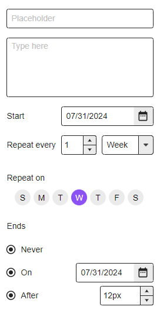

# Billmanager

React.js and Express.js

## Recurring event capabilities

- Yearly
  - Every n years on a date
  - Every n years on the 1st, 2nd, 3rd or Last day of a month
- Weekly:
  - Every n weeks on a set of days
- Monthly
  - Every n months on the 1st, 2nd, 3rd or Last day
  - Every n months on a date
- End condition
  - Never
  - On a date
  - Number of occurrences

[Link](https://app.moqups.com/EYrXVAn6iVlY6YI0rwkRGkilM9Q3X9ma/edit/page/ad64222d5)

### Algorithm

- for each payday
  - work out what portion of each bill needs to be deposited
    - if bill occurs > 1 times before next payday:
      - bill amount \* number of occurrences before next payday
    - if number of paydays in bill cycle != 0:
      - bill amount / number of paydays in bill cycle
